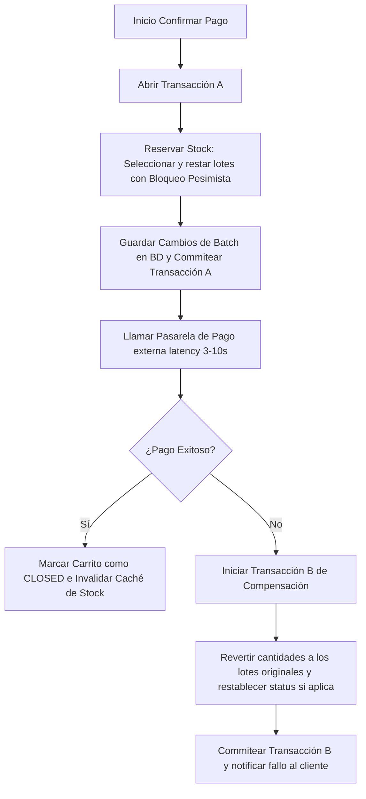

# Seguimiento por Lotes (VG Mayorista)

Diseño técnico y decisiones de arquitectura para implementar la gestión de inventario por lotes (`Batch`) con rotación FEFO, trazabilidad de proveedores y consistencia transaccional.

---

## 1. Definición del Problema y Contexto

El catálogo de VG Mayorista maneja productos perecederos. Gestionar el inventario como un valor global acumulado en la tabla de productos (`Product.stock`) presenta deficiencias operativas y sanitarias graves:
* **Riesgo Sanitario y de Merma:** Sin trazabilidad de fechas de vencimiento, se pueden vender productos caducados o desperdiciar stock por mala rotación.
* **Inviabilidad de FEFO:** La venta no puede priorizar automáticamente las existencias más próximas a vencer.
* **Falta de Trazabilidad:** Ante problemas de calidad con un lote de un proveedor específico, no es posible hacer un retiro dirigido (recall) de las existencias afectadas.

### Objetivo
Reemplazar el campo `Product.stock` en la base de datos y migrar hacia un modelo de lotes independientes (`Batch`). El stock total disponible de un producto será calculado a partir de la sumatoria de las existencias de sus lotes activos y no vencidos, gestionado dinámicamente y expuesto a través de una capa de caché.

---

## 2. Decisiones de Diseño Clave

Basado en el análisis de arquitectura y rendimiento, se han acordado las siguientes decisiones:

### Eje A: Relación de Agregados
* **Decisión:** Dos Agregados independientes (`Product` y `Batch`)
* **Justificación:** `Product` actúa como el catálogo maestro estático. `Batch` gestiona la alta volatilidad del stock físico. Vincularlos mediante `@OneToMany` estricto degradaría el rendimiento de lectura del catálogo y bloquearía la tabla `products` en operaciones concurrentes de inventario (entradas masivas). Mantenerlos independientes permite operaciones ágiles y desacopladas en el área de logística.

### Eje B: Cálculo de Stock
* **Decisión:** Stock Dinámico con Caché Híbrido
* **Justificación:** Se eliminará la columna física `stock` de la tabla `products`. Sin embargo, para evitar la sobrecarga de consultas agregadas (`SUM`) en listados de productos paginados, utilizaremos un Caché en Memoria (Caffeine) para almacenar el stock total calculado.
* **Mecanismo de Consistencia:**
  * **Operaciones de Lectura (Catálogo):** Se consulta el caché. Ante un fallo de caché, se ejecuta un query `SUM` en base de datos sobre los lotes activos y no vencidos del producto, y se repuebla el caché.
  * **Operaciones de Escritura/Actualización:** Cualquier alta de lote, descarte manual o venta exitosa invalida el caché de stock de dicho producto.
  * **Checkout y Confirmación de Pago:** No pasa por el caché general. Se consulta directamente a la base de datos aplicando bloqueos pesimistas para asegurar consistencia transaccional y evitar sobreventa.

---

## 3. Diseño de la Solución

### 3.1. Esquema de Base de Datos

Proponemos la eliminación de la columna `stock` de `products` y la creación de la tabla `batches`. Incorporamos `supplier_id` para la trazabilidad.

```sql
-- 1. Eliminación de stock físico en products
ALTER TABLE products DROP COLUMN stock;

-- 2. Creación de la tabla de lotes (batches)
CREATE TABLE batches (
    id UUID PRIMARY KEY,
    product_id UUID NOT NULL,
    supplier_id UUID NOT NULL, -- UUID de trazabilidad al proveedor de origen
    batch_number VARCHAR(50) NOT NULL, -- Código de lote identificable (legible)
    quantity INT NOT NULL CHECK (quantity >= 0),
    acquisition_date TIMESTAMP WITHOUT TIME ZONE NOT NULL,
    expiry_date TIMESTAMP WITHOUT TIME ZONE NOT NULL,
    status VARCHAR(20) NOT NULL, -- ACTIVE, EXPIRED, DEPLETED
    created_at TIMESTAMP WITHOUT TIME ZONE NOT NULL,
    updated_at TIMESTAMP WITHOUT TIME ZONE NOT NULL,
    CONSTRAINT fk_batch_product FOREIGN KEY (product_id) REFERENCES products(id),
    CONSTRAINT uk_batch_number UNIQUE (batch_number)
);

-- Índices optimizados para búsquedas rápidas de stock y FEFO
CREATE INDEX idx_batches_fefo ON batches (product_id, expiry_date, quantity) 
WHERE status = 'ACTIVE';
```

> [!TIP]
> **Formato Humano del campo `batch_number`:** Para facilitar la lectura en etiquetas y agilizar las auditorías de inventario manuales mediante PDAs, se establece que el valor guardado en el campo específico `batch_number` (columna `batch_number` de la tabla `batches`) debe seguir el patrón alfanumérico estandarizado en lugar de un UUID autogenerado:
>
> `[CODIGO_PROVEEDOR]-[AÑO_MES]-[SECUENCIAL]` *(Ejemplo: `ORG-2606-001`)*

---

### 3.2. Flujo de Datos en el Checkout (Metodología FEFO)

Para proteger el rendimiento del pool de conexiones de base de datos, el sistema evita mantener bloqueos abiertos mientras consume APIs externas (pasarelas de pago):



#### 3.2.1. Lógica de Consumo Individual y Fraccionado (FEFO en Backend)
El sistema no vende lotes enteros, sino unidades individuales que se descuentan del inventario del lote. Al procesar una venta:
1. El backend consultará los lotes activos ordenados por `expiry_date` ASC (FEFO) aplicando bloqueos de fila (`SELECT ... FOR UPDATE`).
2. Se descontará la cantidad comprada del lote más próximo a vencer.
3. **Consumo en Cascada:** Si la cantidad comprada supera el saldo (`quantity`) del lote más viejo, este lote se agotará (pasando a estado `DEPLETED`) y el sistema continuará descontando el remanente del siguiente lote en la fila, garantizando que el pedido del cliente se cumpla siempre priorizando la salida del stock más antiguo.

### 3.3. Capa de Caché para Catálogo y Lecturas Rápidas
Se implementará un servicio de inventario (`InventoryService`) anotado con `@Cacheable` de Spring. Para mitigar fallas en la invalidación asíncrona, configuraremos un Time-To-Live (TTL) de seguridad en el gestor de caché.

* `@Cacheable(value = "productStock", key = "#productId")`: Obtiene la suma de stock disponible.
* `@CacheEvict(value = "productStock", key = "#productId")`: Invalida la entrada cuando se crea un lote o se concreta un checkout.

---

### 3.4. Consistencia entre Inventario Físico (Góndola) e Inventario Lógico (FEFO)

> [!WARNING]
> En tiendas físicas, los lotes suelen mezclarse en la góndola (estante). Un cliente puede elegir físicamente un producto de un lote más nuevo (vencimiento tardío) mientras que el sistema, por lógica FEFO, descontará del lote más antiguo en base de datos.
>
> Para mitigar esta brecha, evaluamos dos enfoques operativos:

#### Enfoque 1: Escaneo Genérico + FEFO Lógico (Recomendado para retail general)
* **Cómo funciona:** La caja escanea el código de barras estándar del producto (EAN-13). El backend descuenta del lote activo más antiguo utilizando el algoritmo FEFO.
* **Pros:** Velocidad de cobro máxima; no requiere etiquetado individual costoso por unidad.
* **Cons:** Puede haber pequeñas discrepancias entre el stock físico real de un lote en estante y su saldo lógico en base de datos.
* **Mitigación:** Conciliación mediante Auditorías de Inventario Periódicas (Stocktaking).

#### Enfoque 2: Escaneo de Lote Físico Estricto (Recomendado para trazabilidad crítica)
* **Cómo funciona:** Cada producto lleva una etiqueta única (código QR o código de barras GS1-128) que incluye el identificador de producto y el código de lote. Al cobrar, se escanea esta etiqueta específica.
* **Pros:** Consistencia del 100% entre góndola física y base de datos lógica.
* **Cons:** Mayor costo operativo (impresión y etiquetado unitario) y tiempos de checkout más lentos.

**Decisión para VG Mayorista:** Para esta fase del sistema, adoptaremos el Enfoque 1 (FEFO Lógico) por su simplicidad operativa, asumiendo auditorías de inventario manuales periódicas para ajustar desviaciones en los saldos específicos de cada lote.

---

### 3.4.1. Mecánica de la Auditoría Física de Inventario (Sincronización de Lotes)

Para resolver la desviación fina (ej: cuando el cliente se lleva el producto del lote B en vez del lote A en la góndola), se implementará un proceso de sincronización:

1. **El Desajuste Lógico vs. Físico:**
   * Supongamos que en góndola hay 1 paquete de Lote A (vence mañana) y 5 paquetes de Lote B (vence en 10 días).
   * Un cliente compra 1 paquete, pero toma físicamente el del Lote B.
   * La caja escanea el código genérico. El sistema resta 1 del Lote A (por FEFO lógico).
   * **Estado en BD:** Lote A = 0 unidades. Lote B = 5 unidades (Total = 5).
   * **Estado Real en Góndola:** Lote A = 1 unidad. Lote B = 4 unidades (Total = 5). El total coincide, pero la distribución por lote no.

2. **La Auditoría Física (Stocktaking):**
   * Semanal o quincenalmente, un operador recorre las góndolas con una terminal de mano (PDA).
   * El operador escanea el código de barras del producto y el sistema le solicita ingresar las cantidades físicas encontradas por fecha de vencimiento o código de lote (los cuales están legibles en la etiqueta del producto).
   * **Entrada del operador:** "Encontré 1 unidad de Lote A y 4 unidades de Lote B".
   * El backend procesa esta entrada y ejecuta un ajuste de stock:
     * Actualiza la cantidad de `Batch A` a 1 y estado `ACTIVE`.
     * Actualiza la cantidad de `Batch B` a 4.
     * Invalida el caché de stock del producto.

3. **Beneficio:** Esta rutina garantiza que las discrepancias no se acumulen a largo plazo y permite al personal detectar físicamente mermas (robos o productos dañados que deben ser dados de baja manualmente en el sistema).

---

## 4. Cambios Propuestos

### Modificaciones en el Dominio y Modelo

#### [MODIFY] [Product.java](file:///d:/programacion/distribuidora/src/main/java/com/distribuidora/model/Product.java)
* Eliminar el atributo `@NotNull @Min(0) private Integer stock;` y sus getters/setters.

#### [NEW] [Batch.java](file:///d:/programacion/distribuidora/src/main/java/com/distribuidora/model/Batch.java)
* Nueva entidad JPA para la tabla `batches`.
* Atributos: `id`, `productId`, `supplierId`, `batchNumber`, `quantity`, `acquisitionDate`, `expiryDate`, `status` (Enum: `BatchStatus`), `createdAt`, `updatedAt`.

#### [NEW] [BatchStatus.java](file:///d:/programacion/distribuidora/src/main/java/com/distribuidora/model/BatchStatus.java)
* Enum con los estados: `ACTIVE`, `EXPIRED`, `DEPLETED`.

---

### Modificaciones en la Capa de Datos (Repositories)

#### [NEW] [BatchRepository.java](file:///d:/programacion/distribuidora/src/main/java/com/distribuidora/repository/BatchRepository.java)
* Interfaz `JpaRepository<Batch, UUID>`.
* **Mapeo SARGable**: Evitamos usar funciones de base de datos (`CURRENT_TIMESTAMP`) en el query dinámico, pasando la fecha actual como parámetro (`Instant now`).
* **Bloqueo Pesimista**: Previene condiciones de carrera al descontar inventario en checkout concurrentes.

```java
package com.distribuidora.repository;

import com.distribuidora.model.Batch;
import com.distribuidora.model.BatchStatus;
import jakarta.persistence.LockModeType;
import org.springframework.data.jpa.repository.JpaRepository;
import org.springframework.data.jpa.repository.Lock;
import org.springframework.data.jpa.repository.Query;
import org.springframework.data.repository.query.Param;

import java.time.Instant;
import java.util.List;
import java.util.UUID;

public interface BatchRepository extends JpaRepository<Batch, UUID> {

    @Lock(LockModeType.PESSIMISTIC_WRITE)
    @Query("SELECT b FROM Batch b WHERE b.productId = :productId AND b.status = :status AND b.expiryDate > :now ORDER BY b.expiryDate ASC")
    List<Batch> findActiveBatchesForWriteFEFO(@Param("productId") UUID productId, @Param("status") BatchStatus status, @Param("now") Instant now);

    @Query("SELECT COALESCE(SUM(b.quantity), 0) FROM Batch b WHERE b.productId = :productId AND b.status = :status AND b.expiryDate > :now")
    Integer sumAvailableStockByProductId(@Param("productId") UUID productId, @Param("status") BatchStatus status, @Param("now") Instant now);
    
    @Query("SELECT DISTINCT b.productId FROM Batch b WHERE b.status = :status AND b.expiryDate < :now")
    List<UUID> findProductIdsWithExpiredBatches(@Param("status") BatchStatus status, @Param("now") Instant now);

    @Query("SELECT b FROM Batch b WHERE b.status = :status AND b.expiryDate < :now")
    List<Batch> findExpiredBatches(@Param("status") BatchStatus status, @Param("now") Instant now);
}
```

---

### Modificaciones en la Capa de Servicios y Schedulers

#### [NEW] [InventoryService.java](file:///d:/programacion/distribuidora/src/main/java/com/distribuidora/service/InventoryService.java)
* Gestiona el stock dinámico e implementa la lógica FEFO y el control de caché:
  * `Integer getAvailableStock(UUID productId)` -> Llama a `sumAvailableStockByProductId` y se marca con `@Cacheable`.
  * `void consumeStockFEFO(UUID productId, Integer quantity)` -> Llama a `findActiveBatchesForWriteFEFO` dentro de una transacción `@Transactional`, realiza el descuento cascada, actualiza los registros a `DEPLETED` e invalida el caché usando `@CacheEvict`.

#### [NEW] [BatchExpirationJob.java](file:///d:/programacion/distribuidora/src/main/java/com/distribuidora/service/scheduler/BatchExpirationJob.java)
* Tarea programada (Spring `@Scheduled` o Quartz) que corre diariamente (ej: `0 1 0 * * *` - 00:01 AM).
* **Propósito**: Busca lotes en estado `ACTIVE` donde `expiryDate` sea menor a la hora actual, actualiza su estado a `EXPIRED`, invalida el caché y realiza Calentamiento de Caché (Cache Warming) para evitar picos de carga (Cache Stampede).

```java
package com.distribuidora.service.scheduler;

import com.distribuidora.model.Batch;
import com.distribuidora.model.BatchStatus;
import com.distribuidora.repository.BatchRepository;
import com.distribuidora.service.InventoryService;
import lombok.RequiredArgsConstructor;
import lombok.extern.slf4j.Slf4j;
import org.springframework.cache.CacheManager;
import org.springframework.scheduling.annotation.Scheduled;
import org.springframework.stereotype.Component;
import org.springframework.transaction.annotation.Transactional;

import java.time.Instant;
import java.util.List;
import java.util.UUID;

@Component
@RequiredArgsConstructor
@Slf4j
public class BatchExpirationJob {

    private final BatchRepository batchRepository;
    private final InventoryService inventoryService;
    private final CacheManager cacheManager;

    @Scheduled(cron = "0 1 0 * * *") // Diariamente a las 00:01 AM
    @Transactional
    public void expireBatches() {
        Instant now = Instant.now();
        log.info("Iniciando proceso automático de expiración de lotes a las {}", now);

        List<UUID> productIdsToEvict = batchRepository.findProductIdsWithExpiredBatches(BatchStatus.ACTIVE, now);
        if (productIdsToEvict.isEmpty()) {
            log.info("No se encontraron lotes activos vencidos.");
            return;
        }

        List<Batch> expiredBatches = batchRepository.findExpiredBatches(BatchStatus.ACTIVE, now);
        for (Batch batch : expiredBatches) {
            batch.setStatus(BatchStatus.EXPIRED);
        }
        batchRepository.saveAll(expiredBatches);

        var cache = cacheManager.getCache("productStock");
        if (cache != null) {
            for (UUID productId : productIdsToEvict) {
                // 1. Evicción (Invalidar)
                cache.evict(productId);
                
                // 2. Calentamiento (Cache Warming) proactivo para evitar estampida
                inventoryService.getAvailableStock(productId);
                log.debug("Caché invalidada y repoblada proactivamente para producto ID: {}", productId);
            }
        }

        log.info("Proceso completado. Se marcaron {} lotes como EXPIRED y se repobló el caché de {} productos.", 
                 expiredBatches.size(), productIdsToEvict.size());
    }
}
```

#### [MODIFY] [CartService.java](file:///d:/programacion/distribuidora/src/main/java/com/distribuidora/service/CartService.java)
* Modificar `validateAllItems` y `decrementStock` para integrarlos con `InventoryService`.
* Separar la confirmación del stock en una transacción independiente y proveer la lógica de compensación/devolución en caso de que el cobro asíncrono falle.

---

### Modificaciones en la Configuración

#### [NEW] [CacheConfig.java](file:///d:/programacion/distribuidora/src/main/java/com/distribuidora/config/CacheConfig.java)
* Habilita `@EnableCaching`.
* Registra el `CacheManager` configurando Caffeine con un TTL de fallback de seguridad (ej. 15 minutos).

```java
package com.distribuidora.config;

import com.github.benmanes.caffeine.cache.Caffeine;
import org.springframework.cache.CacheManager;
import org.springframework.cache.annotation.EnableCaching;
import org.springframework.cache.caffeine.CaffeineCacheManager;
import org.springframework.context.annotation.Bean;
import org.springframework.context.annotation.Configuration;

import java.util.concurrent.TimeUnit;

@Configuration
@EnableCaching
public class CacheConfig {

    @Bean
    public CacheManager cacheManager() {
        CaffeineCacheManager cacheManager = new CaffeineCacheManager("productStock");
        cacheManager.setCaffeine(Caffeine.newBuilder()
                .expireAfterWrite(15, TimeUnit.MINUTES) // TTL de seguridad
                .maximumSize(10000)); // Límite de entradas para evitar fugas de memoria
        return cacheManager;
    }
}
```

---

## 5. Plan de Verificación

### Pruebas Automatizadas

#### 5.1. Concurrencia y Consumo Cascara FEFO (`InventoryServiceConcurrencyTest`)
* **Test de Consistencia FEFO Cascada (Matemático):**
  * *Escenario:* Un producto con 3 lotes: Lote A (vence en 2 días, stock: 10), Lote B (vence en 5 días, stock: 15), Lote C (vence en 10 días, stock: 20).
  * *Acción:* Solicitar una compra de 18 unidades.
  * *Verificaciones:*
    * Lote A debe quedar en `DEPLETED` (cantidad = 0).
    * Lote B debe quedar en `ACTIVE` con cantidad = 7.
    * Lote C debe quedar intacto en `ACTIVE` con cantidad = 20.
    * Confirmar matemáticamente el orden y cantidad consumida de cada registro en base de datos.
* **Test de Concurrencia Extrema:**
  * *Escenario:* 10 hilos concurrentes intentan consumir 5 unidades cada uno de un producto que solo cuenta con 40 unidades totales distribuidas en varios lotes.
  * *Acción:* Ejecutar peticiones en paralelo utilizando un `CountDownLatch` y un pool de hilos (`ExecutorService`).
  * *Verificaciones:*
    * Solo 8 hilos deben procesarse con éxito; los otros 2 deben lanzar `ProductUnavailableException`.
    * Validar que el stock final sea exactamente 0 y que el `@Lock(LockModeType.PESSIMISTIC_WRITE)` evitó condiciones de carrera de lectura sucia o sobreventa.

#### 5.2. Scheduler, Expiración y Estado de Caché (`BatchExpirationJobTest`)
* **Simulación de Avance del Tiempo:**
  * *Escenario:* Cargar lotes con `expiryDate` en el pasado inmediato y estado `ACTIVE`.
  * *Acción:* Invocar programáticamente el job `expireBatches()` simulando la medianoche.
  * *Verificaciones:*
    * Los lotes antiguos deben cambiar su estado a `EXPIRED` en la base de datos de manera definitiva.
    * Capturar la llamada del `CacheManager` y validar que el método `cache.evict(productId)` fue disparado exitosamente para el producto afectado. Esto asegura que no se exponga "stock fantasma" a futuros compradores.

#### 5.3. Reversión (Rollback) por Cancelación o Falla en el Pago
* **Test de Rollback del Inventario:**
  * *Escenario:* Se procesa una transacción de compra que consume cascada FEFO sobre el Lote A y el Lote B.
  * *Acción:* Forzar una excepción de negocio en el procesamiento de pago posterior al consumo (ej. error simulado de pasarela) para activar la reversión de Spring `@Transactional`.
  * *Verificaciones:*
    * Verificar que la cantidad en Lote A y Lote B regresa exactamente al saldo inicial.
    * Confirmar que si Lote A había sido transicionado a `DEPLETED` durante el flujo, su estado se revierte a `ACTIVE`.

#### 5.4. Integración E2E contra Base de Datos Real (`ProductControllerE2ETest`)
* *Entorno:* Utilización de Testcontainers para instanciar una base de datos PostgreSQL real efímera.
* *Acción:* Alta de producto -> Ingreso de Lotes -> Consulta GET catálogo -> Compra -> Re-consulta GET catálogo.
* *Verificaciones:*
  * El API debe exponer el stock consolidado desde la agregación inicial.
  * Tras la compra, el catálogo debe reflejar de inmediato la merma exacta calculada.

#### 5.5. Observabilidad, Monitoreo y Fallos del Scheduler
* **Test de Alertas de Fallos:**
  * *Escenario:* Simular que el Scheduler nocturno encuentra un bloqueo de base de datos al intentar actualizar los lotes vencidos.
  * *Acción:* Mockear una excepción a nivel de persistencia durante el procesamiento de `expireBatches()`.
  * *Verificaciones:*
    * Comprobar que la excepción es capturada y registrada con nivel de severidad `ERROR` en los logs del sistema para disparar alertas de observabilidad.
    * Asegurar que el estado del caché no se corrompe ni desincroniza ante transacciones a medias.

---

## 6. Pruebas Manuales
* **Pruebas de Carga y Concurrencia:** Utilizar herramientas externas como k6 o Apache Benchmark en el ambiente de desarrollo local para estresar el endpoint de checkout y comprobar que los tiempos de respuesta y la consistencia de inventario cumplen con los Acuerdos de Nivel de Servicio (SLA).
